# Praktikum 13: Framework Lanjutan (Modul Login)

#### Nama   : Fajar Firmansyah
#### Nim    : 312010309
#### Kelas  : TI.20.A2

### Langkah-langkah Praktikum

### Persiapan.

Untuk memulai membuat modul Login, yang perlu disiapkan adalah database server
menggunakan MySQL. Pastikan MySQL Server sudah dapat dijalankan melalui
XAMPP.

### Membuat Table User

Masuk kedalam databse `lab_ci4` dan buat table baru seperti dibawah ini

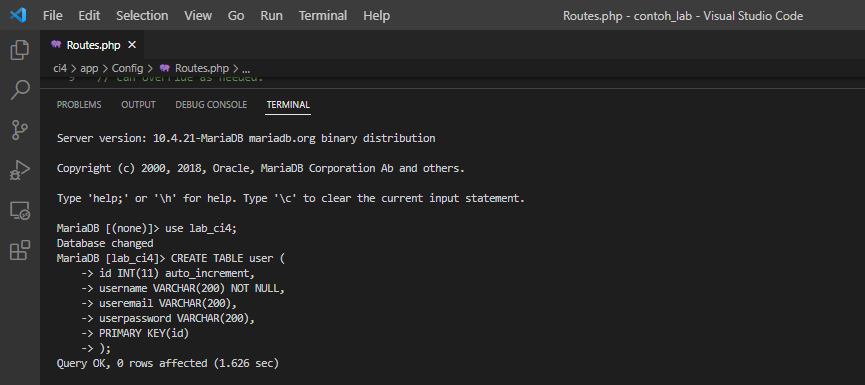

### Membuat Model User

Selanjutnya adalah membuat Model untuk memproses data Login. Buat file baru pada
direktori `app/Models` dengan nama `UserModel.php`

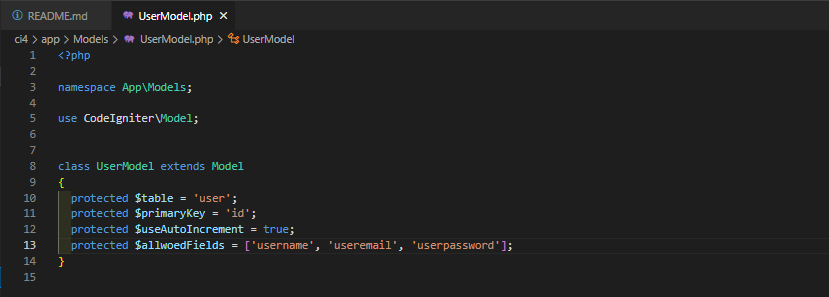

### Membuat Controller User

Buat Controller baru dengan nama `User.php` pada direktori `app/Controllers`.
Kemudian tambahkan method `index()` untuk menampilkan daftar user, dan method
`login()` untuk proses login.

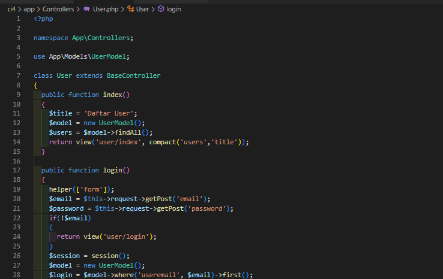

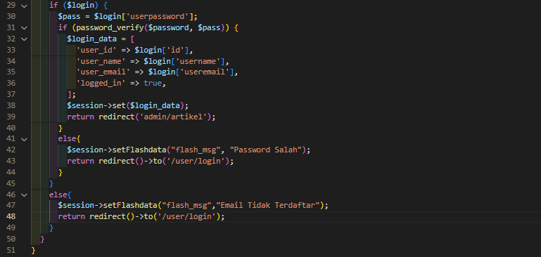

### Membuat View Login

Buat direktori baru dengan nama `user` pada direktori `app/views`, kemudian buat file
baru dengan nama `login.ph`p. 

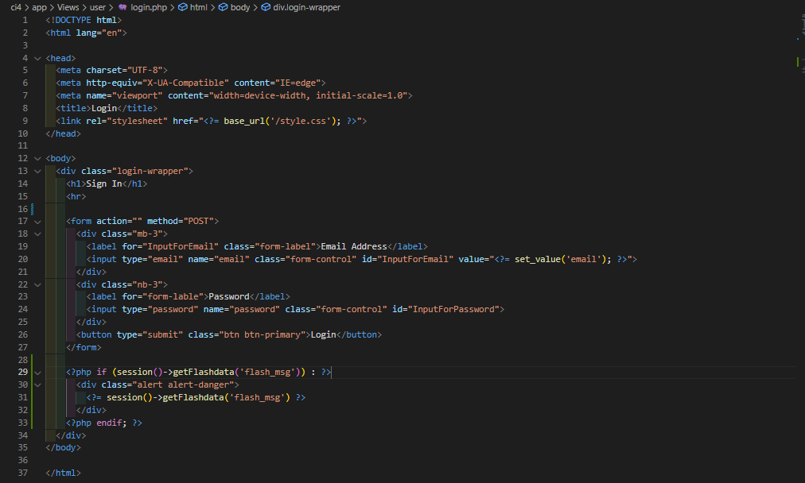

### Membuat Database Seeder

Database seeder digunakan untuk membuat data dummy. Untuk keperluan ujicoba modul
login, kita perlu memasukkan data user dan password kedaalam database. Untuk itu buat
database seeder untuk tabel user. Buka CLI, kemudian tulis perintah berikut:

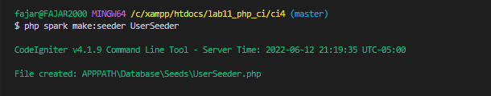

Selanjutnya, buka file `UserSeeder.php` yang berada di lokasi direktori
`/app/Database/Seeds/UserSeeder.php` kemudian isi dengan kode berikut:

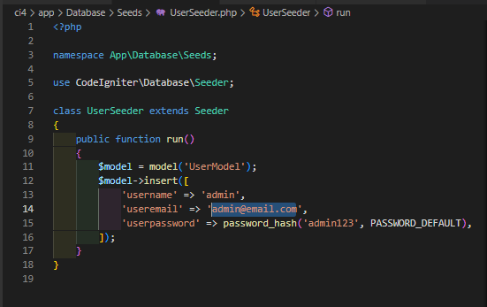

Selanjutnya buka kembali CLI dan ketik perintah berikut:

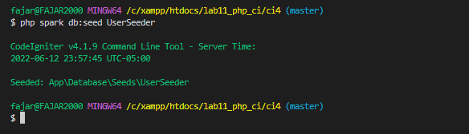

### Uji Coba Login

Selanjutnya buka url http://localhost:8080/user/login seperti berikut:

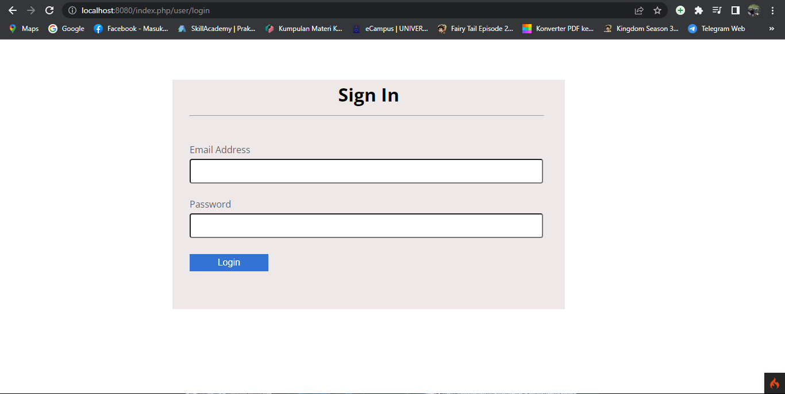

### Menambahkan Auth Filter

Selanjutnya membuat filer untuk halaman admin. Buat file baru dengan nama `Auth.php`
pada direktori app/Filters. 

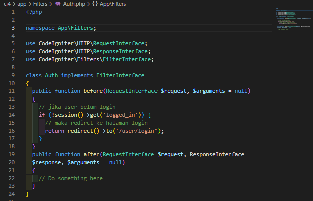

Selanjutnya buka file app/Config/Filters.php tambahkan kode berikut:

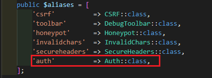

Selanjutnya buka file app/Config/Routes.php dan sesuaikan kodenya.

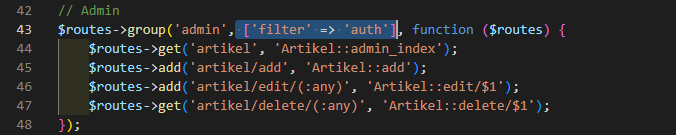

### Percobaan Akses Menu Admin

Buka url dengan alamat http://localhost:8080/admin/artikel ketika alamat tersebut
diakses maka, akan dimuculkan halaman login. 

### Fungsi Logout

Tambahkan method logout pada Controller User seperti berikut:

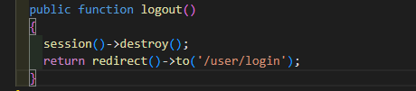

### Pertanyaan dan Tugas

Selesaikan programnya sesuai Langkah-langkah yang ada. Anda boleh melakukan
improvisasi.

#### Membuat Tombol Home pada bagian login

pada bagian `views\user\login.php` tembahkan tombol untuk kembali ketampilan awal.

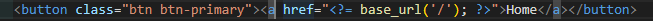

Tampilan

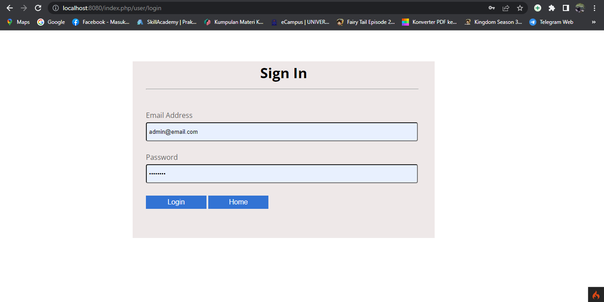

#### Membuat Tombol Logout

Memberikan tombol logout pada bagian admin

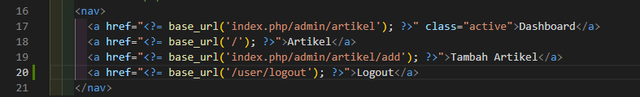

Tampilan

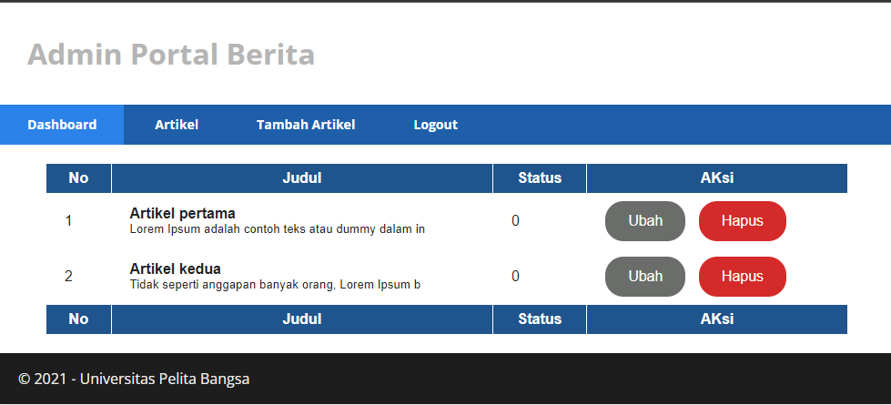

