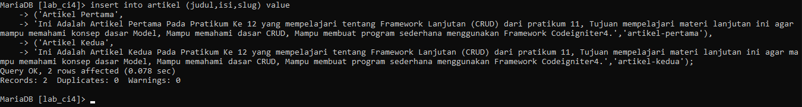

# Praktikum 12:Framework Lanjutan (CRUD)

### Instruksi Praktikum

1. Persiapkan text editor misalnya VSCode.
2. Buka kembali folder dengan nama lab11_php_ci pada docroot webserver (htdocs)
3. Ikuti langkah-langkah praktikum yang akan dijelaskan berikutnya.

### Langkah-langkah Praktikum
### Persiapan.

Untuk memulai membuat aplikasi CRUD sederhana, yang perlu disiapkan adalah
database server menggunakan MySQL. Pastikan MySQL Server sudah dapat dijalankan
melalui XAMPP.
Membuat Database: Studi Kasus Data Artikel

### Membuat Databases 

### Membuat table Artikel

### Konfigurasi koneksi database

Konfigurasi Koneksi Database, konfigurasi untuk menghubungkan dengan database, setver. Konfigurasi dapat dilakukan dengan dua cara yaitu :

1. app/config/database.php

2. Pada bagian File .env 

### Membuat Model
Selanjutnya adalah membuat Model untuk memproses data Artikel. Buat file baru pada
direktori app/Models dengan nama ArtikelModel.php

### Membuat Controller

Buat Controller baru dengan nama Artikel.php pada direktori app/Controllers.

### Membuat View

Buat direktori baru dengan nama `artikel` 

Pada direktori app/views, kemudian buat file
baru dengan nama `index.php`.

Selanjutnya buka browes, dengan mengakses URL http://localhost:8080/artikel

Belum ada data yang ditampilkan. Maka Tambahkan beberapa data pada database agar bisa ditampilkan.

Refresh kembali browser, sehingga akan ditampilkan hasilnya.

### Membuat Tampilan Detail Artikel

Tampilan pada saat judul berita di klik maka akan diarahkan ke halaman yang berbeda. Tambahkan fungsi baru pada Controller Artikel dengan nama view().

### Membuat View Detail

Buat view baru untuk halaman detail dengan nama app/views/artikel/detail.php.

### Membuat Routing untuk artikel detail

Buka Kembali file app/config/Routes.php, kemudian tambahkan routing untuk artikel detail.

Refresh kembali browser, lalu pilih salah satu artikel sehingga akan ditampilkan hasilnya.

### Membuat Menu Admin

Menu admin adalah untuk proses CRUD data artikel. Buat method baru pada Controller Artikel dengan nama admin_index().

Selanjunya pada bagian views artikel buat file dengan nama admin_index.php

Tambahkan routing untuk menu admin seperti berikut:

Akses menu admin dengan url http://localhost:8080/admin/artikel

### Menambah Data Artikel

Tambahkan fungsi/method baru pada Controller Artikel dengan nama add().

Kemudian buat view untuk form tambah dengan nama form_add.php

Akses URL http://localhost:8080/index.php/admin/artikel/add

### Mengubah Data

Tambahkan fungsi/method baru pada Controller Artikel dengan nama edit().

Kemudian buat view untuk form tambah dengan nama form_add.php

refres browser lalu klik tombol ubah 

### Menghapus Data

Tambahkan fungsi/method baru pada Controller Artikel dengan nama delete().

# Pertanyaan dan Tugas

Selesaikan programnya sesuai Langkah-langkah yang ada. Anda boleh melakukan improvisasi.

# Laporan Praktikum
1. Melanjutkan praktikum sebelumnya pada repository dengan nama Lab11Web.
2. Kerjakan semua latihan yang diberikan sesuai urutannya.
3. Screenshot setiap perubahannya.
4. Update file README.md dan tuliskan penjelasan dari setiap langkah praktikum beserta screenshotnya.
5. Commit hasilnya pada repository masing-masing.
6. Kirim URL repository pada e-learning ecampus

